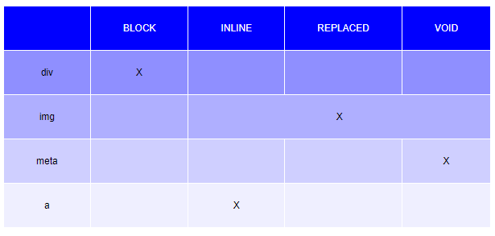

#  PRÁCTICA 7 - Tabla clasificadora
1. Crea un elemento tabla.
2. Crea 5 filas con etiquetas 'tr'.
3. Crea dentro de cada fila 5 columnas con etiquetas 'td'.
4. Aplica el diseño que ves en la imagen



### NOTAS
- La sintaxis genérica simple de table es la siguiente:

    ```
    <table>
        <tr class="fila">
            <td class="columna">contenido de celda</td>
            <td class="columna">contenido de celda</td>
        </tr>
        <tr class="fila">
            <td class="columna">contenido de celda</td>
            <td class="columna">contenido de celda</td>
       </tr>
    </table>
    ```


### REFERENCIAS
- MDN Elemento tabla - https://developer.mozilla.org/en-US/docs/Web/HTML/Element/table