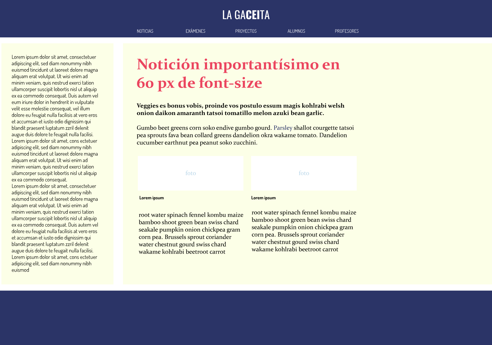

# PRÁCTICA 8 - Periódico
1. Trasladar a código el siguiente diseño, centrándonos en la estructura y el html.Si terminamos pasamos a aplicar estilos de color

 <br><br><br>

2. Céntrate en la estructura y el html y si terminas pasa a aplicar estilos de color

### NOTAS

- Los elementos estructurales no semánticos de HTML no aportan información sobre su contenido.

```
<div></div>: Contenedor tipo 'block' genérico.
<span></span>: Contenedor tipo 'inline' genérico.
```
<br><br>

- Los elementos estructurales semánticos de HTML5 nos permiten crear bloques con mayor definición en cuanto al contenido que estructuran.

```
<header></header>: Define el header de una página web.
<footer></footer>: Define el footer de una página web.
<nav><nav>: Contiene funcionalidad de navegación de la página.
<article></article>: Contiene una pieza de contenido con significado a nivel de unidad. Por ejemploun post de un blog.
<section></section>: Agrupa elementyo / contenidos subyacentes con el mismo propósito.
<main><main> / <aside></aside>: Defin un contenido que se relaciona entre si con funcionalidad principal-secundario. Por ejemplo un sidebar.
```
<br>


### REFERENCIAS
- MDN Elementos HTML - https://developer.mozilla.org/es/docs/Web/HTML/Element
- POst sobre elementos semánticos https://www.eniun.com/html5-estructura-basica-elementos-semanticos/